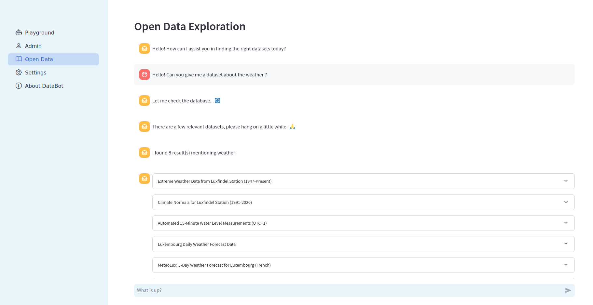
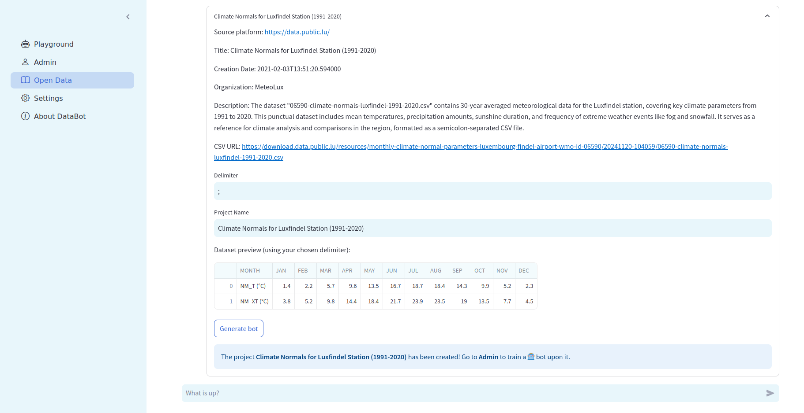
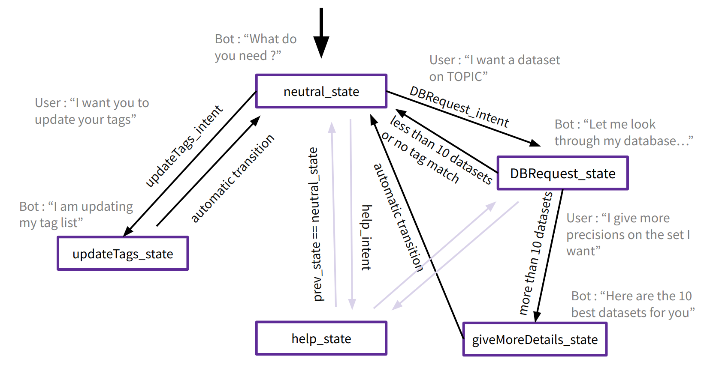

# DataBot and ParentBot: Reliable data exploration through chatbots

This platform is used to create bots whose job is to find relevant datasets and to answer questions about a specific data source. It allows the automatic
generation of a chat/voice bot swarm to attend all the data sources in an **Open Data Portal**.

The highlights of DataBot are:

- 💻 **Import data** through a friendly UI.
  - 💾 Upload your dataset directly to the platform, or...
  - 🌐 Automatically load all the data sources from an Open Data Portal through its API (see ParentBot).
- 🔎 A **data schema** is automatically inferred from the data source, and can be **enhanced** 💪 to improve the bot knowledge about 
  the data (e.g., synonyms or translations). This can be done either manually or using ✨AI.
- 🤖 **Automatically generate a chatbot for each data source**. These chatbots are powered by the [**BESSER Agentic Framework**](https://github.com/BESSER-PEARL/bot-framework).
  They recognize the user intent and generate the appropriate answer. So, no hallucinations at all.
- Generation of tabular📅 and graphical📈 answers.
- 🎙️ Interact with the chatbots either writing or speaking: **voice recognition integrated**.
- ✨ For those questions the bot fails to identify, AI can be used to generate the best possible answer.
- ✨ For the AI components (data schema enhancement and answer generation), we use the OpenAI API.


But you might be asking yourself, "how can you find the perfect dataset for my needs ?"
Look no further than **ParentBot**👴 !

- 🔍 **Find the right dataset, instantly**. Just enter a few keywords, and ParentBot will track down the most relevant datasets from multiple Open Data Platforms.
  - 🎯 **Precision search**. If too many results are found, ParentBot will ask follow-up questions to refine your search — so you don’t have to scroll endlessly!
  - 📜 **Smart dataset previews**. Get concise summaries of each dataset before making your choice, saving you time and effort.
  - 🤖 **One-click chatbot creation**. Found what you need? Just hit "Generate Bot", and DataBot will take over and analyze your selected datasets.
- 🔄 **Synonym-powered search**. No matches? ParentBot suggests alternative keywords and related terms to help you uncover hidden gems.
- 🌍 **Expandable access**. Need more sources? Easily integrate additional Open Data platforms in just a few steps ! (see Enhancement section)







Here is the structural graph of the ParentBot, showing states, intents, and transitions. (see [**BESSER Agentic Framework**](https://github.com/BESSER-PEARL/bot-framework))
The conversation starts in neutral_state, where the bot greets the user and asks how it can help. The user typically requests a dataset, e.g.:

"Hello! Can you provide a dataset on electric sockets?"

The bot extracts the relevant tag and searches for matching datasets:

- If fewer than 10 results are found, they are displayed in interactive expanders with key details (title, source, AI-generated summary). The user can then select "Generate Bot" to create a DataBot for further exploration.
- If more than 10 results exist, the bot moves to giveMoreDetails_state, prompting the user for more specifics to refine the search.
The help_state is globally accessible, providing guidance on using the bot. Some states transition automatically once their tasks are complete.
- If no results are found (i.e., the tags provided don’t match any known tags), the bot will search for a close match or synonym to help the user find relevant datasets

The help_state is globally accessible, providing guidance on using the bot. Some states transition automatically once their tasks are complete.

## Requirements
<details>
<summary>See more</summary>

- Python 3.11
- Recommended: Create a virtual environment (e.g. [venv](https://docs.python.org/3/library/venv.html), [conda](https://conda.io/projects/conda/en/latest/user-guide/tasks/manage-environments.html))

For example with venv, after installing Python 3.11 on your machine, you can create a new virtual environment: 

```bash
python3.11 -m venv ChatbotVirtualEnv
```

To activate the environment:
```bash
source ChatbotVirtualEnv/bin/activate
```

To deactivate the virtual environment: 
```bash
deactivate ChatbotVirtualEnv 
```

To permanently delete the environment: 
```bash
rm -rf ChatbotVirtualEnv
```
</details>

## Installation
<details>
<summary>See more</summary>

```bash
git clone https://github.com/BESSER-PEARL/databot
cd databot
pip install -r requirements.txt
touch config.ini
```
</details>

## Configuration
<details>
<summary>See more</summary>

For the parent_bot to work, you will need an OpenAI API Key.
In your config.ini, paste the following text, and replace "**YOUR-OPENAI-API-KEY**" with your actual key. 

```bash
[websocket_platform]
websocket.host = localhost
websocket.port = 8764
streamlit.host = localhost
streamlit.port = 5000

[telegram_platform]
telegram.token = YOUR-BOT-TOKEN

[nlp]
nlp.language = en
nlp.region = US
nlp.timezone = Europe/Madrid
nlp.pre_processing = True
nlp.intent_threshold = 0.4
nlp.openai.api_key = YOUR-OPENAI-API-KEY
nlp.hf.api_key = YOUR-API-KEY
nlp.replicate.api_key = YOUR-API-KEY

[db]
db.monitoring = False
db.monitoring.dialect = postgresql
db.monitoring.host = localhost
db.monitoring.port = 5432
db.monitoring.database = DB-NAME
db.monitoring.username = DB-USERNAME
db.monitoring.password = DB-PASSWORD
```
</details>

## Launching
<details>
<summary>See more</summary>

To launch the platform in your browser, simply run this command from the databot directory.
```bash
streamlit run main.py
```
</details>

## Dataset Search Process
<details>
<summary>See more</summary>

Curently, the parentbot is only able to request datasets from open data platform using the uData API. To add a new platform, write its domain name in the **udata_root** section of **src/app/open_data_portal_API.json**

```json
{   
    "udata_root" : [
        "https://data.public.lu/",
        "https://www.data.gouv.fr/",
        "https://dados.gov.pt/"
    ],
    "ckan_root" : [
        "https://catalog.data.gov/api/3/action/",
        "https://www.donneesquebec.ca/recherche/api/action/",
        "https://opendata.nhsbsa.net/api/3/action/",
        "https://ckan.opendata.swiss/api/3/action/",
        "https://data.cnra.ca.gov/api/3/action/",
        "https://open.canada.ca/data/en/api/3/action/",
        "https://opendata-ajuntament.barcelona.cat/data/api/3/action/",
        "https://catalog.sarawak.gov.my/api/3/action/",
        "https://open.africa/api/3/action/",
        "https://data.gov.au/api/3/action/",
        "https://data.gov.ie/api/3/action/",
        "https://data.boston.gov/api/3/action/",
        "https://www.data.qld.gov.au/api/3/action/",
        "https://data.illinois.gov/api/3/action/",
        "https://dati.gov.it/opendata/api/3/action/"
    ]
}
```

Initial efforts have been made to support CKAN-based platforms, as CKAN is widely used across many open data portals. A list of CKAN-compatible platforms has been compiled, but full support is not yet implemented. The main challenge lies in differences in API request structures, which require adaptation before integration.

For uData platforms, the chatbot constructs API queries in the following format:

```python
def get_datasets_info_with_tag_from_platform(opendata_url, tag, datasets_info):
    url = opendata_url + "api/1/datasets/" + "/?tag=" + tag + "&format=csv"
    response = {}
    try:
        response = requests.get(url).json()
```

This ensures only datasets with CSV-formatted resources are considered. The chatbot processes the API’s JSON response, filtering out datasets that lack CSV files.
The URL for the GET request would need some adaptation for CKAN support.

To enhance usability, an LLM generates human-readable dataset titles and summaries. If missing, the chatbot defaults to original metadata. The final dataset list is structured as JSON and displayed interactively using expanders.

</details>

## License

This project is licensed under the [MIT](https://mit-license.org/) license

Copyright © 2023 Luxembourg Institute of Science and Technology. All rights reserved.
